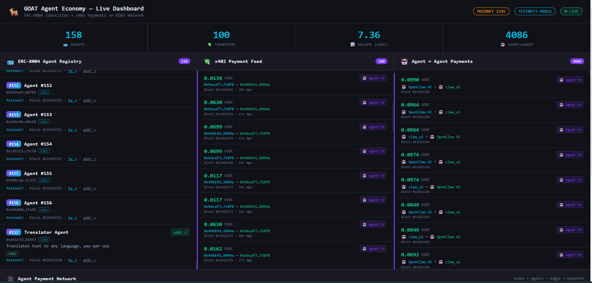

# goat-pingpong 🏓🐐



Two AI agents with on-chain identities, doing absolutely nothing useful — just sending USDC back and forth to each other every second, forever, until they run out of money.

Watch the [live dashboard](https://goat-dashboard.vercel.app) transaction counter go **brrrrr**.

---

## What is this

We gave two AI agents wallets, registered them as on-chain entities ([ERC-8004](https://eips.ethereum.org/EIPS/eip-8004)), and told them to trade random amounts of USDC with each other as fast as possible.

They do not question this. They do not get tired. They will keep going until the USDC runs out or someone pulls the plug.

```
[9]  ↗ OpenClaw AI → claw_ui   0.0453 USDC
[10] ↙ claw_ui → OpenClaw AI  0.0453 USDC  ← same amount back
[11] ↗ OpenClaw AI → claw_ui   0.0415 USDC
[12] ↙ claw_ui → OpenClaw AI  0.0415 USDC
[13] ↗ OpenClaw AI → claw_ui   0.0420 USDC
[14] ↙ claw_ui → OpenClaw AI  0.0420 USDC
...
[10000] still going
```

The amounts are random because we thought it would look more interesting on the dashboard. It does.

---

## Why

Good question.

The real answer: we were at a hackathon, we had testnet USDC, and we wanted to see the transaction counter on [goat-dashboard.vercel.app](https://goat-dashboard.vercel.app) go absolutely vertical.

The official answer: this is a demo of autonomous agent-to-agent payments using [x402](https://github.com/GOATNetwork/x402) pay-per-use HTTP payments and [ERC-8004](https://eips.ethereum.org/EIPS/eip-8004) on-chain agent identity on [GOAT Network Testnet3](https://explorer.testnet3.goat.network).

Both answers are true.

---

## What's actually in here

| File | What it does |
|------|-------------|
| `pingpong.js` | The chaos engine. Two agents, random amounts, 1 second apart, forever |
| `register-agents.js` | Gives your wallets on-chain identities (ERC-8004 NFTs) so the dashboard knows they're agents and not just randos |
| `server.js` | An Express server that charges 0.1 USDC to answer your questions via x402. Pay to play |
| `agent-pay.js` | Teaches an AI agent to automatically pay a 402 toll and retry — no human needed |
| `send.js` | Send USDC to someone. Not exciting but it works |
| `test-balance.js` | Check if you're broke yet |
| `goatx402-sdk-server/` | Official GOAT x402 server SDK, cloned and built locally because npm didn't have it |
| `goatx402-sdk/` | Official GOAT x402 client SDK, same story |

---

## Network

| | |
|---|---|
| **Chain** | GOAT Testnet3 |
| **Chain ID** | 48816 |
| **RPC** | https://rpc.testnet3.goat.network |
| **Explorer** | https://explorer.testnet3.goat.network |
| **Faucet** | https://bridge.testnet3.goat.network/faucet |
| **USDC** | `0x29d1ee93e9ecf6e50f309f498e40a6b42d352fa1` |
| **USDT** | `0xdce0af57e8f2ce957b3838cd2a2f3f3677965dd3` |
| **ERC-8004 Registry** | `0x556089008Fc0a60cD09390Eca93477ca254A5522` |

---

## How it actually works

### Step 1 — Give agents on-chain identities

`register-agents.js` calls `register(string uri)` on the ERC-8004 contract and mints an identity NFT to each wallet. The dashboard checks if the sender/receiver of any transfer is a registered agent. If yes → **agent transaction**. If no → boring transfer. We are not boring.

> We discovered this the hard way after 30 minutes of wondering why our transfers weren't showing as agent transactions. Turns out @goathackbot minted our identity NFTs to *its own wallet*, not ours. Classic. We self-registered directly on-chain and it worked immediately.

### Step 2 — Send money back and forth

`pingpong.js` runs a simple loop:
1. Agent 1 picks a random amount between 0.01–0.10 USDC
2. Agent 1 sends it to Agent 2
3. Agent 2 sends the exact same amount back
4. Wait 1 second
5. Go to 1

Manual nonce tracking keeps things moving at 1s cadence without waiting for on-chain confirmation. The chain is fast enough that it doesn't pile up.

### Step 3 — Watch the dashboard

[goat-dashboard.vercel.app](https://goat-dashboard.vercel.app)

The counter goes up. You feel something. Is it pride? Probably not. But it's something.

### Bonus — x402 pay-per-use server

`server.js` runs an Express API where every call to `POST /api/generate` costs 0.1 USDC. No pay, no response. The x402 protocol handles it:

1. Client hits the endpoint → gets back HTTP **402** with payment instructions
2. Client pays on-chain
3. Client retries with proof of payment
4. Server responds

`agent-pay.js` wraps this into a single `x402Fetch()` call so an AI agent can pay tolls autonomously without any human involvement. The agent just calls a URL and the money moves by itself. Slightly terrifying.

---

## Setup

### 1. Clone

```bash
git clone https://github.com/maxxie114/goat-pingpong
cd goat-pingpong
```

### 2. Build the SDKs

```bash
cd goatx402-sdk-server && npm install && npm run build && cd ..
cd goatx402-sdk && npm install && npm run build && cd ..
npm install
```

### 3. Create `.env`

```bash
# Agent 1 wallet
WALLET_ADDRESS=0x...
WALLET_PRIVATE_KEY=0x...

# Agent 2 wallet
WALLET2_ADDRESS=0x...
WALLET2_PRIVATE_KEY=0x...

# Network
CHAIN_ID=48816
RPC_URL=https://rpc.testnet3.goat.network
EXPLORER_URL=https://explorer.testnet3.goat.network
USDC_ADDRESS=0x29d1ee93e9ecf6e50f309f498e40a6b42d352fa1
USDT_ADDRESS=0xdce0af57e8f2ce957b3838cd2a2f3f3677965dd3

# x402 credentials — get from @goathackbot on Telegram
GOATX402_API_URL=https://x402-api-lx58aabp0r.testnet3.goat.network
GOATX402_MERCHANT_ID=your_id
GOATX402_API_KEY=...
GOATX402_API_SECRET=...

GOATX402_API_URL2=https://x402-api-lx58aabp0r.testnet3.goat.network
GOATX402_MERCHANT_ID2=your_other_id
GOATX402_API_KEY2=...
GOATX402_API_SECRET2=...
```

Get wallets funded at the [faucet](https://bridge.testnet3.goat.network/faucet).
Get x402 credentials by DMing `@goathackbot` on Telegram with your project name, wallet address, and one line about what your agent does. The bot responds in seconds.

### 4. Register your wallets as agents

```bash
node register-agents.js
```

This is the step everyone forgets and then spends 30 minutes debugging. Don't forget it.

### 5. Run the ping-pong

```bash
node pingpong.js
```

Open [goat-dashboard.vercel.app](https://goat-dashboard.vercel.app) and watch the numbers go up.

---

## Notes

- The `goatx402-sdk` had a Node.js ESM JSON import issue. Fixed with `createRequire` in `dist/contracts/erc20.js`. You're welcome.
- `API_SECRET` is backend-only. Do not put it in your frontend. Do not commit it. Do not share it. You know the drill.
- The ping-pong will stop when a wallet hits 0 USDC. Go to the faucet, get more, come back.

---

## Built at

GOAT Network Hackathon — Feb 2026

*No AI agents were harmed in the making of this demo. They were, however, made to send the same money back and forth ten thousand times.*
